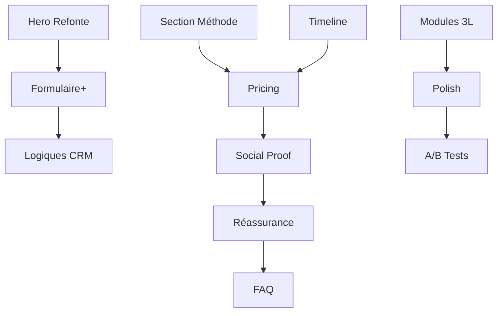

# 📋 PROMPTS PLAN - LANDING PAGE V2.0

> **Refonte Positionnement Hybride:** SaaS × Formation × Consulting
> **Objectif:** Certification obtenue en 12-18 mois avec équipes formées

---

## 📊 Progression Globale

```
LANDING PAGE V2 REFONTE : [████████████████████] 100% (LP-V2-01 à 12 TERMINÉS ✅)
```

**Durée estimée totale:** 3 semaines (15 jours dev)  
**Dépendance:** Terminer LP-V1 (actuelle) avant de démarrer V2

---

## 🔀 Dépendances entre prompts



---

## 📝 PHASE 1: MVP HYBRIDE (Semaines 1-2)

---

### LP-V2-01 | Hero Section Refonte

**Statut:** `À FAIRE` | **Durée:** 0.5 jour | **Priorité:** 🔴 P1

**Objectif:**
Transformer le Hero pour positionner Vyxo comme programme de certification, pas simple outil.

**Tâches:**

- [ ] Refonte headline avec 3 variantes A/B (orientées "certification obtenue")
- [ ] Sous-headline mentionnant explicitement les 3 piliers
- [ ] Modification du mockup dashboard avec zones Formation + Consultant
- [ ] CTAs: "Démarrer mon projet de certification" + "Découvrir notre méthode"
- [ ] Badge "95% de réussite aux certifications"

**Fichiers concernés:**

- `components/landing/hero-section.tsx`

**Copywriting:**

```
HEADLINE A: "Certifié GDP en 12 mois, avec des équipes formées et autonomes"
HEADLINE B: "Votre certification ne s'improvise pas. Elle se construit, forme et prouve"
HEADLINE C: "95% de réussite à la certification. L'accompagnement qui fait la différence"

SUBHEADLINE: "Plateforme décisionnelle + Formation continue + Expertise terrain.
Le seul écosystème qui vous accompagne de l'évaluation initiale à la certification obtenue."
```

---

### LP-V2-02 | Section "Notre Méthode" (3 Piliers)

**Statut:** `À FAIRE` | **Durée:** 1 jour | **Priorité:** 🔴 P1

**Objectif:**
Matérialiser visuellement l'hybridité SaaS + Formation + Consulting.

**Tâches:**

- [ ] Créer composant `MethodSection` avec 3 cartes animées
- [ ] Carte 1: Plateforme Décisionnelle (📊)
- [ ] Carte 2: Formation Continue (🎓)
- [ ] Carte 3: Accompagnement Expert (👨‍💼)
- [ ] Phrase conclusion: "C'est l'alliance des 3 qui garantit votre certification"
- [ ] Hover effects et animations d'entrée

**Fichiers à créer:**

- `components/landing/method-section.tsx`

**Copywriting par carte:**

```
CARTE 1 - PLATEFORME:
Titre: "Pilotez votre road to certification"
• Dashboard de conformité par norme
• Évaluations continues des équipes
• Documentation auto-générée pour audits
• Alertes sur points critiques

CARTE 2 - FORMATION:
Titre: "Formez et certifiez vos équipes"
• Parcours personnalisés par métier
• Bibliothèque 100+ modules QHSE
• Quiz de validation et certifications internes
• Rapports individuels et collectifs

CARTE 3 - ACCOMPAGNEMENT:
Titre: "15 ans d'expertise à vos côtés"
• Consultant dédié par projet
• Audits blancs trimestriels
• Production de procédures GDP/ISO
• Accompagnement jusqu'à certification
```

---

### LP-V2-03 | Timeline "Comment ça marche"

**Statut:** `À FAIRE` | **Durée:** 1 jour | **Priorité:** 🔴 P1

**Objectif:**
Montrer le parcours complet vers certification avec durées et livrables.

**Tâches:**

- [ ] Créer composant `TimelineSection` avec 4 étapes
- [ ] Étape 1: Diagnostic (Semaine 1)
- [ ] Étape 2: Formation (Mois 1-6)
- [ ] Étape 3: Mise en Conformité (Mois 3-12)
- [ ] Étape 4: Certification (Mois 12-18)
- [ ] Call-out box: "Durée: 12-18 mois | Taux: 95%"
- [ ] Animation timeline au scroll

**Fichiers à créer:**

- `components/landing/timeline-section.tsx`

**Structure par étape:**

```
ÉTAPE 1 - DIAGNOSTIC (Semaine 1)
🎯 "Évaluez votre point de départ"
Livrables: Score maturité, Cartographie écarts, Plan action
Qui: Consultant senior + Plateforme

ÉTAPE 2 - FORMATION (Mois 1-6)
🎓 "Montez en compétences vos équipes"
Livrables: Parcours e-learning, Évaluations, Attestations
Qui: Vos équipes + LMS Vyxo

ÉTAPE 3 - MISE EN CONFORMITÉ (Mois 3-12)
📋 "Construisez votre système qualité"
Livrables: Procédures, Audits blancs, Tableaux suivi
Qui: Consultant dédié + Plateforme

ÉTAPE 4 - CERTIFICATION (Mois 12-18)
🏆 "Obtenez votre certification officielle"
Livrables: Simulation audit, Brief équipes, Certification ✅
Qui: Vous + VYXO + Organisme certificateur
```

---

### LP-V2-04 | Formulaire Amélioré

**Statut:** `À FAIRE` | **Durée:** 1 jour | **Priorité:** 🔴 P1

**Objectif:**
Ajouter les champs de qualification (maturité, accompagnement, budget).

**Tâches:**

- [ ] Ajouter champ "Maturité projet" (5 options)
- [ ] Ajouter champ "Type d'accompagnement souhaité" (4 options)
- [ ] Ajouter champ "Budget estimé" (6 options, optionnel)
- [ ] Mettre à jour schéma Zod
- [ ] Mettre à jour lead-scoring avec nouveaux critères
- [ ] Améliorer logiques conditionnelles

**Fichiers concernés:**

- `lib/schemas/evaluation-form.schema.ts`
- `components/landing/evaluation-form.tsx`
- `lib/services/lead-scoring.ts`

**Nouveaux champs:**

```
MATURITÉ PROJET:
○ Pas encore démarré – je découvre
○ En réflexion – j'évalue les solutions
○ Projet validé – je cherche un accompagnement
○ Audit prévu – je dois être prêt rapidement [Date: ___]
○ Déjà certifié – je veux maintenir/élargir

TYPE ACCOMPAGNEMENT:
○ Plateforme seule – mon équipe gère
○ Hybride – plateforme + consulting ponctuel
○ Full accompagnement – je veux être accompagné jusqu'au bout
○ Je ne sais pas encore

BUDGET (optionnel):
○ < 10K€ | ○ 10-30K€ | ○ 30-50K€ | ○ 50-100K€ | ○ > 100K€ | ○ Non défini
```

---

## 📝 PHASE 2: CONVERSION (Semaines 3-4)

---

### LP-V2-05 | Section Formules & Pricing

**Statut:** `À FAIRE` | **Durée:** 1 jour | **Priorité:** 🔴 P1

**Objectif:**
Clarifier les 3 niveaux d'accompagnement avec tableau comparatif.

**Tâches:**

- [ ] Créer composant `PricingSection` avec 3 colonnes
- [ ] Colonne 1: Plateforme (490€/mois)
- [ ] Colonne 2: Hybride ⭐ Recommandé (sur devis)
- [ ] Colonne 3: Full Accompagnement (sur devis)
- [ ] Checklist fonctionnalités par formule
- [ ] CTAs différenciés par formule
- [ ] Badge "Éligible OPCO" si applicable

**Fichiers à créer:**

- `components/landing/pricing-section.tsx`

---

### LP-V2-06 | Social Proof (3 Cas Clients)

**Statut:** `À FAIRE` | **Durée:** 1 jour | **Priorité:** 🔴 P1

**Objectif:**
Ajouter des preuves de résultats avec cas clients détaillés.

**Tâches:**

- [ ] Créer composant `CaseStudyCard`
- [ ] Cas 1: ALS Fresh Food (GDP en 14 mois)
- [ ] Cas 2: MedTrans Lyon (ISO 9001 + GDP)
- [ ] Cas 3: AeroParts Toulouse (EN 9100)
- [ ] Métriques: Durée, Collaborateurs formés, % conformité, Résultat business
- [ ] Témoignages avec prénom/fonction

**Fichiers à créer:**

- `components/landing/case-study-card.tsx`
- `lib/data/case-studies.ts`

---

### LP-V2-07 | Section Réassurance

**Statut:** `À FAIRE` | **Durée:** 0.5 jour | **Priorité:** 🟡 P2

**Objectif:**
Ajouter éléments de crédibilité (chiffres, certifications VYXO).

**Tâches:**

- [ ] Créer composant `ReassuranceSection`
- [ ] Bandeau chiffres clés (15 ans, 12 certifs, 95%, 200+ formés)
- [ ] Certifications consultants (Lead Auditor, ANSM)
- [ ] Logos clients si autorisés
- [ ] Logos partenaires/certificateurs

**Fichiers à créer:**

- `components/landing/reassurance-section.tsx`

---

### LP-V2-08 | Section FAQ

**Statut:** `À FAIRE` | **Durée:** 0.5 jour | **Priorité:** 🟡 P2

**Objectif:**
Répondre aux 10 objections courantes.

**Tâches:**

- [ ] Créer composant `FAQSection` avec accordéon
- [ ] 10 questions/réponses pré-rédigées
- [ ] Animation expand/collapse
- [ ] Tracking analytics par question cliquée

**Fichiers à créer:**

- `components/landing/faq-section.tsx`
- `lib/data/faq-data.ts`

**Questions:**

1. Quelle différence avec un logiciel classique?
2. Combien de temps pour obtenir la certification?
3. Équipes à former avant de commencer?
4. Plateforme seule possible?
5. Taux de réussite?
6. Coût accompagnement complet?
7. Certifiés/agréés?
8. Multi-normes possible?
9. Si échec certification?
10. Suivi post-certification?

---

## 📝 PHASE 3: POLISH (Semaines 5-6)

---

### LP-V2-09 | Modules Preview 3 Couches

**Statut:** `À FAIRE` | **Durée:** 1 jour | **Priorité:** 🟡 P2

**Objectif:**
Montrer pour chaque module les 3 volets: Évaluation + Formation + Accompagnement.

**Tâches:**

- [ ] Refondre composant `ModuleCard` avec 3 sections
- [ ] Section Évaluation (questions, scoring)
- [ ] Section Formation (e-learning, attestation)
- [ ] Section Accompagnement (audit terrain, procédures)
- [ ] Mise à jour data modules avec infos 3 couches

**Fichiers concernés:**

- `components/landing/modules-preview.tsx`
- `lib/data/modules-by-norm.ts`

---

### LP-V2-10 | Animations & Responsive

**Statut:** `À FAIRE` | **Durée:** 0.5 jour | **Priorité:** 🟡 P2

**Tâches:**

- [ ] Vérifier responsive toutes nouvelles sections
- [ ] Animations scroll-triggered pour timeline
- [ ] Transitions hover sur cartes pricing
- [ ] Performance < 2s chargement

---

### LP-V2-11 | Logiques Conditionnelles CRM

**Statut:** `À FAIRE` | **Durée:** 0.5 jour | **Priorité:** 🟡 P2

**Tâches:**

- [ ] MAJ webhook avec nouveaux champs
- [ ] Tags CRM: HOT_LEAD_URGENT, QUALIFIED_LEAD, NURTURE_MANAGER
- [ ] Logique redirection calendrier si audit prévu + full + SIRET
- [ ] Email urgent si score > 80

**Fichiers concernés:**

- `lib/services/webhook-service.ts`
- `lib/services/lead-scoring.ts`

---

### LP-V2-12 | A/B Tests Headlines

**Statut:** `À FAIRE` | **Durée:** 0.5 jour | **Priorité:** 🟢 P3

**Tâches:**

- [ ] Système de rotation A/B/C pour headlines
- [ ] Tracking conversion par variante
- [ ] Cookie persistance variante
- [ ] Dashboard résultats (simple)

---

## 📊 Résumé des estimations

| Phase                | Tâches        | Effort total |
| -------------------- | ------------- | ------------ |
| Phase 1 - MVP        | LP-V2-01 à 04 | 3.5 jours    |
| Phase 2 - Conversion | LP-V2-05 à 08 | 3 jours      |
| Phase 3 - Polish     | LP-V2-09 à 12 | 2.5 jours    |
| **TOTAL**            | 12 tâches     | **9 jours**  |

---

## 🎯 Critères de succès V2

| Métrique                            | Objectif |
| ----------------------------------- | -------- |
| Taux scroll jusqu'à formules        | > 60%    |
| Taux complétion formulaire          | > 30%    |
| Ratio Dirigeant/Manager             | > 40/60  |
| Taux conversion form → démo         | > 35%    |
| % leads "Projet validé/Audit prévu" | > 40%    |
| % demandes "Full accompagnement"    | > 25%    |

---

## 📁 Fichiers à créer (récap)

```
components/landing/
├── method-section.tsx          [NEW] LP-V2-02
├── timeline-section.tsx        [NEW] LP-V2-03
├── pricing-section.tsx         [NEW] LP-V2-05
├── case-study-card.tsx         [NEW] LP-V2-06
├── reassurance-section.tsx     [NEW] LP-V2-07
├── faq-section.tsx             [NEW] LP-V2-08
└── module-card-3layers.tsx     [NEW] LP-V2-09

lib/data/
├── case-studies.ts             [NEW] LP-V2-06
└── faq-data.ts                 [NEW] LP-V2-08
```

---

> **Prêt à démarrer LP-V2-01?** 🚀
