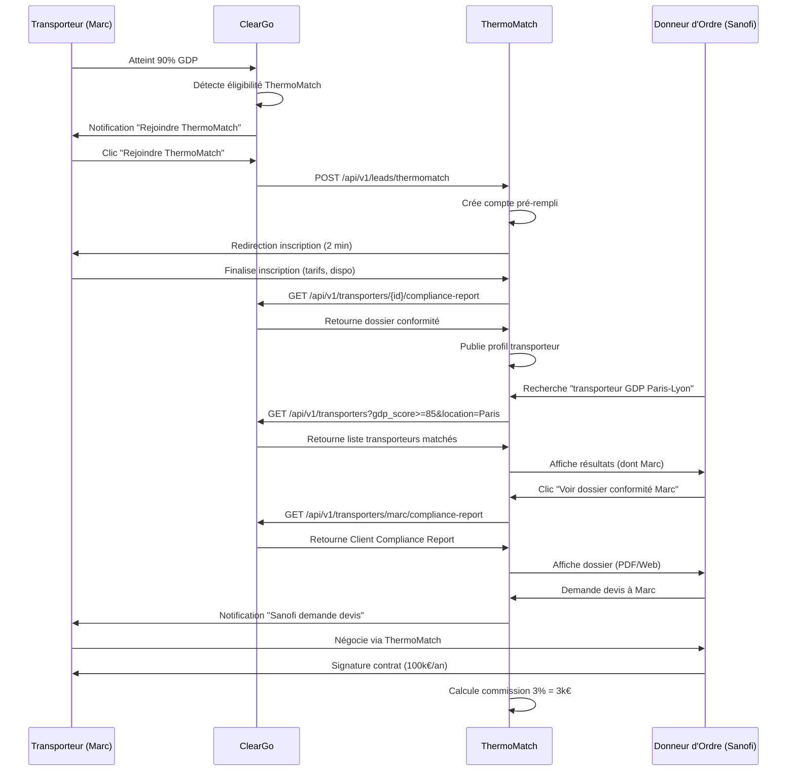
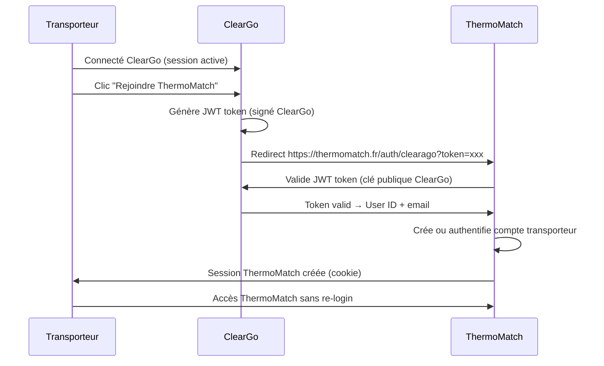

# ClearGo → ThermoMatch : Évaluation Sous-Traitants & Lead Generation

*Date : 17 janvier 2026*  
*Version : 1.0*

---

## 📋 SOMMAIRE

1. [Vision Stratégique](#vision)
2. [Use Cases Complets](#use-cases)
3. [Algorithme d'Évaluation Sous-Traitants](#algo)
4. [Passerelle ClearGo → ThermoMatch](#passerelle)
5. [Business Model & Monétisation](#business)
6. [Architecture Technique](#architecture)
7. [Roadmap Intégration](#roadmap)

---

## 🎯 1. VISION STRATÉGIQUE <a name="vision"></a>

### Problème Actuel Marché

**Côté Donneurs d'Ordre (Pharma/Agro) :**
> "Comment trouver des transporteurs GDP-compliant fiables ? Les bourses de fret classiques ne filtrent pas sur la conformité."

**Côté Transporteurs :**
> "J'ai investi dans GDP, mais comment me faire connaître des donneurs d'ordre premium ?"

### Solution : Écosystème ClearGo + ThermoMatch

**ClearGo** = Plateforme de **préparation & certification** conformité
**ThermoMatch** = Marketplace de **mise en relation** basée sur conformité

**Synergie :**
```
Transporteur → ClearGo (se structure) → Atteint 90% GDP → 
→ Éligible ThermoMatch → Référencé marketplace → 
→ Mis en relation donneurs d'ordre → Gagne contrats
```

**Valeur ajoutée unique :**
- ClearGo **prépare** le transporteur
- ThermoMatch **connecte** le transporteur
- **Aucun concurrent** ne fait les deux

---

### Modèle d'Affaires (Double Revenue Stream)

**Stream 1 : ClearGo (SaaS B2B)**
- Transporteur paie 499€/mois pour accompagnement conformité
- Revenue stable, récurrent

**Stream 2 : ThermoMatch (Marketplace B2B2B)**
- Commission sur contrats signés (3-5% CA contrat)
- Revenue variable, scalable

**Exemple concret :**
> Transporteur X paie ClearGo 6 000€/an (accompagnement)  
> + Gagne contrat Sanofi via ThermoMatch (100k€/an)  
> + ThermoMatch prend 3% commission = 3 000€/an  
> **Total revenue / client : 9 000€/an**

---

## 🔍 2. USE CASES COMPLETS <a name="use-cases"></a>

### Use Case 1 : Donneur d'Ordre Cherche Transporteur GDP

**Acteurs :**
- **Sanofi** (donneur d'ordre pharma)
- **ClearGo** (évaluation transporteurs)
- **ThermoMatch** (marketplace mise en relation)

**Workflow :**

**Étape 1 : Sanofi a un besoin**
- Besoin : Transport température contrôlée Paris → Lyon (100k€/an)
- Exigences : GDP + ISO 9001 + Traçabilité 24/7

**Étape 2 : Sanofi consulte ThermoMatch**
- Recherche : "Transporteurs GDP Paris-Lyon"
- Filtre : Score GDP ≥ 85%, Flotte Euro 6, Capacité frigo

**Étape 3 : ThermoMatch interroge ClearGo API**
- ThermoMatch appelle API ClearGo
- Requête : `GET /api/transporters?gdp_score>=85&location=Paris&services=temperature_controlled`
- ClearGo retourne liste transporteurs matchés (avec scores temps réel)

**Étape 4 : Sanofi voit résultats enrichis**
```
┌─────────────────────────────────────────────────────────┐
│  RÉSULTATS RECHERCHE (3 transporteurs matchés)         │
└─────────────────────────────────────────────────────────┘

1. XYZ LOGISTICS (Paris 15e)
   ────────────────────────────
   GDP Score      : ⭐⭐⭐⭐⭐ 92/100 (ClearGo Certified)
   ISO 9001       : ✅ 95/100
   Flotte frigo   : 8 véhicules (Euro 6)
   Disponibilité  : Immédiate
   Tarif indicatif: 1 200€/jour
   
   [Voir dossier conformité ClearGo]
   [Demander devis ThermoMatch]

2. ABC TRANSPORT (Ivry-sur-Seine)
   ────────────────────────────
   GDP Score      : ⭐⭐⭐⭐ 88/100 (ClearGo Certified)
   ISO 9001       : ✅ 90/100
   Flotte frigo   : 5 véhicules (Euro 6)
   Disponibilité  : Sous 48h
   Tarif indicatif: 1 100€/jour
   
   [Voir dossier conformité ClearGo]
   [Demander devis ThermoMatch]

3. FRESHTRANS (Rungis)
   ────────────────────────────
   GDP Score      : ⭐⭐⭐⭐ 86/100 (ClearGo Certified)
   ISO 9001       : ⚠️ 75/100 (en cours)
   Flotte frigo   : 12 véhicules (Euro 6)
   Disponibilité  : Sous 24h
   Tarif indicatif: 1 050€/jour
   
   [Voir dossier conformité ClearGo]
   [Demander devis ThermoMatch]
```

**Étape 5 : Sanofi clique "Voir dossier conformité ClearGo"**
- Redirection vers Client Compliance Report du transporteur
- Sanofi voit détails : procédures GDP, certifications, audits, etc.
- **Confiance immédiate** (dossier pro, pas juste profil marketplace)

**Étape 6 : Sanofi demande devis via ThermoMatch**
- ThermoMatch met en relation Sanofi ↔ XYZ Logistics
- Négociation prix/conditions
- Signature contrat

**Étape 7 : Commission ThermoMatch**
- Contrat signé : 100k€/an
- ThermoMatch prend 3% = **3 000€** (année 1)
- XYZ Logistics reste client ClearGo : **6 000€/an**
- **Total revenue : 9 000€/an**

---

### Use Case 2 : Transporteur ClearGo Atteint Éligibilité ThermoMatch

**Acteurs :**
- **Marc** (dirigeant XYZ Logistics, client ClearGo)
- **ClearGo** (accompagnement conformité)
- **ThermoMatch** (marketplace)

**Workflow :**

**Mois 1-4 : Marc structure son entreprise avec ClearGo**
- Création documents GDP
- Suivi roadmap
- Scoring GDP progresse : 60% → 75% → 85%

**Mois 5 : Marc atteint 90% GDP**

Dashboard ClearGo affiche :

```
┌─────────────────────────────────────────────────────────┐
│  🎉 FÉLICITATIONS MARC !                                │
└─────────────────────────────────────────────────────────┘

Vous avez atteint 90% GDP (Good Distribution Practice)

Vous êtes maintenant éligible pour rejoindre ThermoMatch,
la marketplace premium des transporteurs pharma certifiés.

📈 AVANTAGES THERMOMATCH

• Visibilité auprès de 150+ donneurs d'ordre pharma
• Sanofi, Novartis, Pfizer, GSK, etc.
• Contrats premium (50-200k€/an)
• 0€ d'inscription (gratuit pour clients ClearGo)

💰 ESTIMATION REVENUS

Basé sur votre profil, vous pourriez capter :
• 2-4 nouveaux contrats pharma/an
• +150-300k€ CA additionnel

🔗 INSCRIPTION FACILITÉE

Vos données ClearGo sont automatiquement transférées :
✅ Dossier de conformité GDP
✅ Certifications
✅ Scoring temps réel
✅ Procédures auditées

[Bouton : Rejoindre ThermoMatch (2 min)]
```

**Marc clique "Rejoindre ThermoMatch"**

**Formulaire pré-rempli :**
```
┌─────────────────────────────────────────────────────────┐
│  INSCRIPTION THERMOMATCH (Données ClearGo)             │
└─────────────────────────────────────────────────────────┘

✅ Entreprise : XYZ Logistics (pré-rempli)
✅ SIRET : 123 456 789 00012 (pré-rempli)
✅ Conformité GDP : 92/100 (ClearGo Certified)
✅ Conformité ISO 9001 : 95/100 (ClearGo Certified)
✅ Flotte : 8 véhicules frigo Euro 6 (pré-rempli)
✅ Couverture géographique : Île-de-France (pré-rempli)

À compléter :
• Tarification (€/jour, €/km)
• Disponibilités (planning)
• Références clients (optionnel)

[Bouton : Finaliser inscription (1 min)]
```

**Résultat :**
- Marc inscrit sur ThermoMatch en **3 minutes** (vs 30 min inscription classique)
- Profil vérifié immédiatement (via ClearGo)
- Visible par donneurs d'ordre dès J+1

**Lead qualifié généré : ✅**

---

### Use Case 3 : Audit Sous-Traitant pour Donneur d'Ordre

**Acteurs :**
- **Sanofi** (donneur d'ordre)
- **Transporteur Y** (sous-traitant existant, pas client ClearGo)
- **ClearGo** (audit externe)
- **ThermoMatch** (lead generation)

**Workflow :**

**Étape 1 : Sanofi veut auditer sous-traitant actuel**
- Sanofi travaille avec Transporteur Y (non-certifié GDP)
- Doute sur conformité réelle
- Besoin : Audit externe indépendant

**Étape 2 : Sanofi commande audit ClearGo**
- Via ThermoMatch ou ClearGo direct
- Service : "Audit Conformité Sous-Traitant"
- Prix : 500€ (forfait)

**Étape 3 : ClearGo audite Transporteur Y**
- Questionnaire GDP envoyé à Transporteur Y
- Upload documents demandé
- Analyse IA + validation expert ClearGo

**Étape 4 : ClearGo génère rapport audit**

```
┌─────────────────────────────────────────────────────────┐
│  RAPPORT AUDIT SOUS-TRAITANT                           │
│  Transporteur Y — Commandé par Sanofi                   │
└─────────────────────────────────────────────────────────┘

📊 SCORING CONFORMITÉ

GDP (Pharma)         : ⚠️ 62/100 (Non-conforme)
ISO 9001            : ⚠️ 55/100 (Non-conforme)
Traçabilité         : ⚠️ 70/100 (Insuffisant)
Sécurité Transport  : ✅ 85/100 (Conforme)

───────────────────────────────────────────────────────────

🚨 NON-CONFORMITÉS CRITIQUES (3)

1. Absence procédures GDP documentées
   Risque : Audit ANSM = Sanction donneur d'ordre
   
2. Traçabilité température incomplète
   Risque : Rupture chaîne du froid non détectable
   
3. Formations chauffeurs GDP non prouvées
   Risque : Mauvaises pratiques manipulation

───────────────────────────────────────────────────────────

⚠️ NON-CONFORMITÉS MINEURES (5)

[Détails...]

───────────────────────────────────────────────────────────

✅ POINTS FORTS (2)

• Flotte moderne (Euro 6)
• Maintenance préventive rigoureuse

───────────────────────────────────────────────────────────

💡 RECOMMANDATIONS

POUR SANOFI :
• Risque moyen-élevé de maintenir ce sous-traitant
• Alternative 1 : Exiger mise en conformité sous 3 mois
• Alternative 2 : Changer de sous-traitant

POUR TRANSPORTEUR Y :
• Accompagnement ClearGo recommandé (3-6 mois)
• Coût : 6 000€/an (vs risque perte contrat Sanofi)

───────────────────────────────────────────────────────────

[Bouton : Voir transporteurs alternatifs (ThermoMatch)]
[Bouton : Proposer accompagnement ClearGo au sous-traitant]
```

**Étape 5A : Si Sanofi clique "Voir transporteurs alternatifs"**
- Redirection vers ThermoMatch
- Recherche pré-filtrée : Transporteurs GDP ≥ 85%
- **Lead ThermoMatch généré : ✅**

**Étape 5B : Si Sanofi clique "Proposer accompagnement ClearGo"**
- Email automatique envoyé à Transporteur Y :

> "Sanofi, votre client, a commandé un audit de conformité GDP via ClearGo.
> 
> Résultat : 62/100 (non-conforme).
> 
> Pour maintenir votre contrat Sanofi, vous devez atteindre 85/100 minimum.
> 
> ClearGo vous accompagne vers la conformité en 3-6 mois.
> 
> [CTA : Réserver diagnostic gratuit]"

- **Lead ClearGo généré : ✅**

---

### Use Case 4 : Lead Generation Proactive (IA)

**ClearGo détecte opportunité ThermoMatch via scoring**

**Trigger automatique :**
- Transporteur atteint 85% GDP
- Transporteur a indiqué "Je veux des contrats pharma" (onboarding)
- Transporteur situé zone géographique à forte demande (Île-de-France, Lyon, etc.)

**Email automatique :**

```
Objet : Marc, 8 donneurs d'ordre pharma cherchent un transporteur comme vous

Bonjour Marc,

Félicitations ! Votre score GDP a atteint 88/100.

📊 ANALYSE OPPORTUNITÉS (Cette semaine)

Nous avons détecté 8 appels d'offres pharma actifs qui correspondent 
exactement à votre profil :

1. Sanofi — Paris-Lyon (120k€/an) — Match : 95%
2. Novartis — Paris-Marseille (95k€/an) — Match : 92%
3. GSK — Paris-Bordeaux (85k€/an) — Match : 88%
[...]

💰 POTENTIEL CA : 300-450k€/an

🎯 POUR RÉPONDRE À CES APPELS D'OFFRES

Inscrivez-vous sur ThermoMatch (2 min, gratuit pour clients ClearGo).
Vos données ClearGo sont transférées automatiquement.

[CTA : Rejoindre ThermoMatch maintenant]

───────────────────────────────────────────────────────────

PS : Ces opportunités sont visibles par d'autres transporteurs.
Premier arrivé, premier servi.
```

**Lead ThermoMatch généré : ✅**

---

## ⚙️ 3. ALGORITHME D'ÉVALUATION SOUS-TRAITANTS <a name="algo"></a>

### Architecture Algorithme

**Inputs :**
1. Données transporteur (ClearGo ou externe)
2. Critères conformité requis (GDP, ISO, ADR, HACCP, etc.)
3. Exigences donneur d'ordre (spécifiques contrat)

**Traitement :**
1. Scoring multi-critères
2. Pondération selon criticité
3. Benchmarking vs référentiel
4. Génération recommandations

**Outputs :**
1. Score global (0-100)
2. Scores par domaine
3. Non-conformités critiques/mineures
4. Recommandations actions
5. Comparaison avec transporteurs similaires

---

### Scoring Multi-Critères

#### Niveau 1 : Domaines Principaux (7)

| Domaine | Poids | Description |
|---------|-------|-------------|
| **GDP (Good Distribution Practice)** | 25% | Conformité PICs/S pharma |
| **ISO 9001** | 20% | Système management qualité |
| **Traçabilité** | 15% | GPS, température, documents |
| **Sécurité Transport** | 15% | AT, formations, habilitations |
| **Flotte & Équipements** | 10% | Véhicules, maintenance, Euro 6 |
| **RH & Compétences** | 10% | Formations chauffeurs, turnover |
| **RSE & Environnement** | 5% | Bilan carbone, certifications |

**Total : 100%**

---

#### Niveau 2 : Sous-Critères GDP (Exemple Détaillé)

**GDP (25% du score total) :**

| Sous-critère | Poids GDP | Méthode évaluation |
|--------------|-----------|-------------------|
| Procédures documentées | 30% | Nb procédures / 12 requis PICs/S |
| Traçabilité température | 25% | Enregistreurs calibrés + historique |
| Formations personnel | 20% | % chauffeurs formés GDP |
| Qualifications équipements | 15% | Certificats étalonnage sondes |
| Audits clients | 10% | Nb audits réussis / total |

**Calcul Score GDP :**
```python
score_gdp = (
    (nb_procedures / 12) * 0.30 +
    (tracabilite_temp_ok / 1) * 0.25 +
    (chauffeurs_formes / total_chauffeurs) * 0.20 +
    (certificats_valides / total_equipements) * 0.15 +
    (audits_reussis / audits_total) * 0.10
) * 100
```

**Score GDP final (sur 100) × 25% = Contribution au score global**

---

#### Niveau 2 : Sous-Critères ISO 9001 (Exemple)

**ISO 9001 (20% du score total) :**

| Chapitre ISO | Poids ISO | Exigences clés |
|--------------|-----------|----------------|
| 4. Contexte | 10% | Parties intéressées, périmètre SMQ |
| 5. Leadership | 15% | Politique qualité, engagement direction |
| 6. Planification | 10% | Objectifs qualité, gestion risques |
| 7. Support | 15% | Ressources, compétences, documentation |
| 8. Réalisation | 25% | Maîtrise opérationnelle, production |
| 9. Évaluation | 15% | Audits internes, indicateurs |
| 10. Amélioration | 10% | Actions correctives, amélioration continue |

**Calcul Score ISO 9001 :**
```python
score_iso = (
    score_chapitre_4 * 0.10 +
    score_chapitre_5 * 0.15 +
    score_chapitre_6 * 0.10 +
    score_chapitre_7 * 0.15 +
    score_chapitre_8 * 0.25 +
    score_chapitre_9 * 0.15 +
    score_chapitre_10 * 0.10
) * 100
```

**Score ISO 9001 final × 20% = Contribution au score global**

---

### Algorithme de Matching (ThermoMatch ↔ ClearGo)

**Objectif :** Matcher donneur d'ordre avec meilleurs transporteurs.

**Inputs Donneur d'Ordre :**
1. Exigences conformité (GDP, ISO, ADR, etc.)
2. Zone géographique (départ → arrivée)
3. Type marchandise (pharma, agro, chimie)
4. Volume (nb palettes, kg, m³)
5. Fréquence (ponctuel, récurrent)
6. Température requise (ambiant, frigo, surgelé)
7. Budget indicatif (€/jour, €/km)

**Algorithme de Scoring Match :**

```python
def calculate_match_score(transporter, order_requirements):
    """
    Calcule score de matching transporteur vs appel d'offres
    Retourne score 0-100
    """
    
    # 1. Score Conformité (50% du match)
    conformity_score = 0
    
    if order_requirements['gdp_required']:
        conformity_score += transporter['gdp_score'] * 0.35
    
    if order_requirements['iso9001_required']:
        conformity_score += transporter['iso9001_score'] * 0.25
    
    if order_requirements['adr_required']:
        conformity_score += transporter['adr_score'] * 0.20
    
    if order_requirements['haccp_required']:
        conformity_score += transporter['haccp_score'] * 0.20
    
    # Normaliser sur 50 points
    conformity_score = (conformity_score / 100) * 50
    
    # 2. Score Géographique (20% du match)
    geo_score = calculate_geo_match(
        transporter['coverage_zones'],
        order_requirements['route']
    ) * 20
    
    # 3. Score Capacité (15% du match)
    capacity_score = calculate_capacity_match(
        transporter['fleet'],
        order_requirements['volume'],
        order_requirements['temperature']
    ) * 15
    
    # 4. Score Disponibilité (10% du match)
    availability_score = calculate_availability(
        transporter['planning'],
        order_requirements['start_date']
    ) * 10
    
    # 5. Score Prix (5% du match)
    # Note : Prix volontairement peu pondéré (conformité > prix)
    price_score = calculate_price_competitiveness(
        transporter['pricing'],
        order_requirements['budget']
    ) * 5
    
    # Score total
    total_score = (
        conformity_score +
        geo_score +
        capacity_score +
        availability_score +
        price_score
    )
    
    return round(total_score, 0)


def calculate_geo_match(coverage_zones, route):
    """
    Calcule match géographique (0-1)
    """
    departure = route['departure']
    arrival = route['arrival']
    
    # Transporteur couvre départ ET arrivée ?
    if departure in coverage_zones and arrival in coverage_zones:
        return 1.0
    
    # Transporteur couvre départ OU arrivée ?
    elif departure in coverage_zones or arrival in coverage_zones:
        return 0.6
    
    # Transporteur ne couvre ni départ ni arrivée
    # Mais calcule distance depuis zones couvertes
    else:
        min_distance = calculate_min_distance(coverage_zones, [departure, arrival])
        
        if min_distance < 50:  # km
            return 0.4
        elif min_distance < 100:
            return 0.2
        else:
            return 0.0


def calculate_capacity_match(fleet, volume, temperature):
    """
    Calcule match capacité flotte (0-1)
    """
    suitable_vehicles = 0
    
    for vehicle in fleet:
        # Véhicule a capacité suffisante ?
        if vehicle['capacity_m3'] >= volume['m3']:
            # Véhicule équipé température requise ?
            if temperature == 'ambient' or vehicle['temperature_control'] == temperature:
                suitable_vehicles += 1
    
    if suitable_vehicles >= 2:
        return 1.0  # Redondance (sécurise contrat)
    elif suitable_vehicles == 1:
        return 0.7  # Minimum viable
    else:
        return 0.0  # Pas de véhicule adapté


def calculate_availability(planning, start_date):
    """
    Calcule disponibilité transporteur (0-1)
    """
    available_days = planning.get_available_days_around(start_date, window=7)
    
    if start_date in available_days:
        return 1.0  # Dispo date exacte
    elif len(available_days) >= 3:
        return 0.8  # Dispo dans semaine
    elif len(available_days) >= 1:
        return 0.5  # Dispo partielle
    else:
        return 0.0  # Pas dispo


def calculate_price_competitiveness(pricing, budget):
    """
    Calcule compétitivité prix (0-1)
    Note : Pondéré faiblement (5%) car conformité prime
    """
    transporter_price = pricing['daily_rate']
    budget_max = budget['daily_rate_max']
    
    if transporter_price <= budget_max * 0.9:
        return 1.0  # Très compétitif
    elif transporter_price <= budget_max:
        return 0.8  # Dans budget
    elif transporter_price <= budget_max * 1.1:
        return 0.5  # Légèrement au-dessus
    else:
        return 0.2  # Hors budget (mais conformité peut justifier)
```

---

### Système de Recommandations

**Basé sur score match, l'algo génère recommandations :**

**Match ≥ 90% → "Excellent Match"**
```
✅ EXCELLENT MATCH (Score : 95/100)

Ce transporteur correspond parfaitement à vos exigences :
• Conformité GDP : 92/100 ⭐⭐⭐⭐⭐
• Zone géographique : Couverture totale
• Capacité : 3 véhicules disponibles
• Disponibilité : Immédiate

Recommandation : Demander devis en priorité
```

**Match 75-89% → "Bon Match"**
```
⚠️ BON MATCH (Score : 82/100)

Ce transporteur est qualifié, avec légères réserves :
• Conformité GDP : 88/100 ⭐⭐⭐⭐
• Zone géographique : Couverture partielle (sous-traitance arrivée)
• Capacité : 1 véhicule disponible (risque si panne)
• Disponibilité : Sous 48h

Recommandation : Option de backup solide
```

**Match 60-74% → "Match Moyen"**
```
⚠️ MATCH MOYEN (Score : 68/100)

Ce transporteur présente des gaps :
• Conformité GDP : 75/100 ⭐⭐⭐ (en cours amélioration)
• Zone géographique : Couverture OK
• Capacité : Véhicules adaptés
• Prix : Compétitif

Recommandation : Vérifier conformité détaillée avant engagement
```

**Match < 60% → "Match Faible"**
```
❌ MATCH FAIBLE (Score : 52/100)

Ce transporteur ne correspond pas à vos exigences :
• Conformité GDP : 62/100 ⚠️ (non-conforme)
• Zone géographique : Hors zone
• Capacité : Flotte inadaptée

Recommandation : Ne pas retenir (risque élevé)
```

---

### Détection Non-Conformités Critiques

**L'algo identifie automatiquement les "deal-breakers" :**

```python
def detect_critical_non_conformities(transporter, requirements):
    """
    Détecte non-conformités critiques (bloquantes)
    """
    critical_issues = []
    
    # 1. GDP requis mais score insuffisant
    if requirements['gdp_required'] and transporter['gdp_score'] < 75:
        critical_issues.append({
            'type': 'gdp_insufficient',
            'severity': 'critical',
            'message': 'Score GDP 62/100 (minimum requis : 75/100)',
            'impact': 'Risque sanction ANSM pour donneur d\'ordre',
            'remediation': 'Accompagnement ClearGo requis (3-6 mois)'
        })
    
    # 2. Absence traçabilité température (pharma)
    if requirements['temperature_control'] and not transporter['has_temperature_tracking']:
        critical_issues.append({
            'type': 'no_temperature_tracking',
            'severity': 'critical',
            'message': 'Absence traçabilité température temps réel',
            'impact': 'Rupture chaîne du froid non détectable',
            'remediation': 'Installation sondes IoT obligatoire'
        })
    
    # 3. Assurance RC insuffisante (pharma)
    if requirements['insurance_min'] and transporter['insurance_rc'] < requirements['insurance_min']:
        critical_issues.append({
            'type': 'insufficient_insurance',
            'severity': 'critical',
            'message': f'RC Pro {transporter["insurance_rc"]/1e6}M€ (minimum : {requirements["insurance_min"]/1e6}M€)',
            'impact': 'Responsabilité donneur d\'ordre non couverte',
            'remediation': 'Augmenter plafond assurance'
        })
    
    # 4. Certifications chauffeurs expirées
    expired_certifications = check_driver_certifications(transporter['drivers'])
    if len(expired_certifications) > 0:
        critical_issues.append({
            'type': 'expired_certifications',
            'severity': 'critical',
            'message': f'{len(expired_certifications)} chauffeurs avec certifications expirées',
            'impact': 'Non-conformité réglementaire immédiate',
            'remediation': 'Renouvellement formations urgent'
        })
    
    # 5. Absence audits internes (ISO 9001)
    if requirements['iso9001_required'] and transporter['last_internal_audit'] is None:
        critical_issues.append({
            'type': 'no_internal_audit',
            'severity': 'major',
            'message': 'Aucun audit interne réalisé',
            'impact': 'Non-conformité ISO 9001 (exigence 9.2)',
            'remediation': 'Planifier audit interne sous 30j'
        })
    
    return critical_issues
```

---

## 🔗 4. PASSERELLE CLEARAGO → THERMOMATCH <a name="passerelle"></a>

### Architecture API

**API ClearGo exposée à ThermoMatch :**

```yaml
# Endpoints principaux

GET /api/v1/transporters
  Description: Liste transporteurs avec scores
  Auth: API Key ThermoMatch
  Params:
    - gdp_score_min (int): Score GDP minimum (0-100)
    - iso9001_score_min (int): Score ISO 9001 minimum
    - location (string): Ville ou région
    - services (array): [temperature_controlled, adr, haccp]
    - fleet_capacity_min (int): Nb véhicules minimum
  Response:
    {
      "transporters": [
        {
          "id": "uuid",
          "company_name": "XYZ Logistics",
          "siret": "123456789",
          "scores": {
            "gdp": 92,
            "iso9001": 95,
            "tracability": 98,
            "safety": 88,
            "rse": 85,
            "global": 91
          },
          "certifications": ["ClearGo Certified GDP", "ClearGo Certified ISO 9001"],
          "fleet": {
            "total_vehicles": 8,
            "temperature_controlled": 8,
            "euro_norm": "Euro 6"
          },
          "coverage_zones": ["Île-de-France", "Auvergne-Rhône-Alpes"],
          "availability": "immediate",
          "compliance_report_url": "https://clearago.fr/reports/xyz-logistics",
          "last_updated": "2026-01-17T10:30:00Z"
        }
      ],
      "total": 3,
      "page": 1
    }

GET /api/v1/transporters/{id}/compliance-report
  Description: Dossier de conformité complet
  Auth: API Key ThermoMatch
  Response:
    {
      "transporter_id": "uuid",
      "report_version": "2.1",
      "generated_at": "2026-01-17T10:30:00Z",
      "valid_until": "2026-07-17",
      "executive_summary": "...",
      "scores": {...},
      "certifications": [...],
      "procedures": [...],
      "audits": [...],
      "non_conformities": [],
      "pdf_url": "https://clearago.fr/reports/xyz-logistics.pdf",
      "web_url": "https://clearago.fr/reports/xyz-logistics"
    }

POST /api/v1/audit-requests
  Description: Commander audit sous-traitant
  Auth: API Key ThermoMatch (ou donneur d'ordre direct)
  Body:
    {
      "client_name": "Sanofi",
      "client_email": "audit@sanofi.com",
      "transporter_siret": "987654321",
      "audit_scope": ["gdp", "iso9001", "tracability"],
      "urgency": "normal"  # normal, urgent
    }
  Response:
    {
      "audit_id": "uuid",
      "status": "pending",
      "estimated_completion": "2026-01-24",
      "price": 500,
      "payment_url": "https://clearago.fr/payment/audit-xyz"
    }

GET /api/v1/audit-requests/{id}
  Description: Statut audit en cours
  Response:
    {
      "audit_id": "uuid",
      "status": "completed",  # pending, in_progress, completed
      "report_url": "https://clearago.fr/audits/sanofi-transportery.pdf",
      "score": 62,
      "critical_issues": 3,
      "recommendation": "non_compliant"
    }

POST /api/v1/leads/thermomatch
  Description: ClearGo envoie lead ThermoMatch
  Auth: API Key ClearGo
  Body:
    {
      "transporter_id": "uuid",
      "trigger": "gdp_score_reached_85",
      "eligibility_criteria": {
        "gdp_score": 88,
        "iso9001_score": 95,
        "fleet_size": 8,
        "coverage_zones": ["Île-de-France"]
      },
      "pre_filled_data": {...}
    }
  Response:
    {
      "lead_id": "uuid",
      "thermomatch_registration_url": "https://thermomatch.fr/register?token=xxx",
      "estimated_revenue_potential": "150k-300k"
    }
```

---

### Workflow Technique Intégration

**Scénario : Transporteur ClearGo → ThermoMatch**



---

### Synchronisation Données Temps Réel

**Problématique :**
- Scores ClearGo évoluent quotidiennement (documents uploadés, actions terminées)
- ThermoMatch doit afficher scores à jour

**Solution : Webhooks + Cache**

**Webhook ClearGo → ThermoMatch :**

```python
# ClearGo envoie webhook à chaque changement score

POST https://thermomatch.fr/webhooks/clearago-score-update
Headers:
  X-ClearGo-Signature: hmac-sha256(secret, payload)
Body:
  {
    "event": "score_updated",
    "transporter_id": "uuid",
    "updated_scores": {
      "gdp": 92,  # était 88
      "iso9001": 95,  # inchangé
      "global": 91  # était 89
    },
    "timestamp": "2026-01-17T10:30:00Z"
  }

# ThermoMatch reçoit webhook
# → Met à jour cache Redis
# → Profil transporteur affiché avec nouveau score immédiatement
```

**Cache Redis (ThermoMatch) :**
```redis
# Durée vie cache : 1h
# Rafraîchi à chaque webhook ClearGo

SET transporter:xyz-logistics:scores {
  "gdp": 92,
  "iso9001": 95,
  "global": 91,
  "last_updated": "2026-01-17T10:30:00Z"
}
EXPIRE transporter:xyz-logistics:scores 3600

# Si cache expiré et pas de webhook
# → ThermoMatch appelle GET /api/v1/transporters/{id}
```

---

### Single Sign-On (SSO)

**Objectif :** Transporteur connecté ClearGo → Automatiquement connecté ThermoMatch

**Workflow OAuth2 :**



**JWT Token Payload :**
```json
{
  "iss": "clearago.fr",
  "sub": "transporter-uuid",
  "email": "marc@xyz-logistics.fr",
  "company_name": "XYZ Logistics",
  "siret": "12345678900012",
  "clearago_subscription": "premium",
  "scores": {
    "gdp": 92,
    "iso9001": 95
  },
  "exp": 1737115800,  # Expiration 1h
  "iat": 1737112200
}
```

---

## 💰 5. BUSINESS MODEL & MONÉTISATION <a name="business"></a>

### Revenue Streams (Détail)

**Stream 1 : ClearGo SaaS (B2B)**

| Offre | Prix/mois | Target | Volume Année 1 | Revenue Année 1 |
|-------|-----------|--------|----------------|-----------------|
| Freemium | 0€ | Tous | 1 000 inscrits | 0€ |
| Diagnostic complet | 299€ (one-shot) | 20% freemium | 200 diagnostics | 59 800€ |
| Abonnement Base | 499€ | 50% diagnostics | 100 abonnés | 598 800€ |
| Abonnement + GDP | 649€ | 30% base | 30 abonnés | 233 640€ |
| Abonnement All-Inclusive | 999€ | 10% base | 10 abonnés | 119 880€ |
| **Total ClearGo** | | | **140 clients actifs** | **~1M€ ARR** |

**Stream 2 : ThermoMatch Marketplace (B2B2B)**

| Service | Modèle | Prix | Volume Année 1 | Revenue Année 1 |
|---------|--------|------|----------------|-----------------|
| Commission contrats | 3% CA contrat (Année 1) | Variable | 50 contrats signés | 150 000€ |
| Audit sous-traitant | Forfait | 500€ | 100 audits | 50 000€ |
| Référencement premium transporteur | Abonnement | 200€/mois | 20 transporteurs | 48 000€ |
| Publicité donneurs d'ordre | CPC/CPM | Variable | — | 20 000€ |
| **Total ThermoMatch** | | | | **~268k€ ARR** |

**TOTAL ÉCOSYSTÈME ANNÉE 1 : ~1,27M€ ARR**

---

### Détail Commissions ThermoMatch

**Modèle dégressif (incitation contrats long-terme) :**

| Durée contrat | Commission Année 1 | Commission Année 2 | Commission Année 3+ |
|---------------|-------------------|-------------------|-------------------|
| Ponctuel (< 3 mois) | 5% CA | — | — |
| Court-terme (3-12 mois) | 4% CA | 2% CA | — |
| Moyen-terme (1-2 ans) | 3% CA | 2% CA | 1% CA |
| Long-terme (2+ ans) | 3% CA | 2% CA | 1% CA |

**Exemple concret :**
> Contrat Sanofi ↔ XYZ Logistics : 100k€/an, 3 ans  
> Année 1 : 3% = **3 000€**  
> Année 2 : 2% = **2 000€**  
> Année 3 : 1% = **1 000€**  
> **Total sur 3 ans : 6 000€**

**Avantage modèle :**
- Incite contrats long-terme (revenue récurrent ThermoMatch)
- Acceptable pour transporteurs (commission décroissante)
- Alignement intérêts (ThermoMatch veut qualité matching, pas juste volume)

---

### Audit Sous-Traitant (Service Premium)

**Pricing Audit :**

| Type audit | Prix | Délai | Inclus |
|------------|------|-------|--------|
| Audit express (GDP seul) | 300€ | 3 jours | Score GDP, 5 pages |
| Audit standard (GDP + ISO) | 500€ | 5 jours | Scores multiples, 15 pages |
| Audit complet (GDP + ISO + RSE) | 800€ | 7 jours | Tous domaines, 25 pages |
| Audit sur site (physique) | 2 000€ | 2 semaines | Expert ClearGo déplacé |

**Upsell Audit → Accompagnement :**
- Si transporteur audité non-conforme (< 75%) → Proposition accompagnement ClearGo
- Conversion attendue : 30-40% (transporteur veut éviter perte contrat client)

**Exemple :**
> 100 audits/an × 500€ = 50k€  
> 35 audités deviennent clients ClearGo (35% conversion)  
> 35 × 6 000€/an = **210k€ ARR additionnel**

---

### Référencement Premium ThermoMatch

**Service : Visibilité boostée sur marketplace**

**Inclus :**
- Badge "Transporteur Vérifié ClearGo" (trust)
- Position prioritaire dans résultats recherche
- Profil détaillé (photos flotte, vidéos, témoignages clients)
- Analytics (nb vues profil, nb devis demandés)
- Alertes opportunités (matching proactif)

**Prix : 200€/mois** (optionnel, en plus abonnement ClearGo)

**Target : Transporteurs premium (déjà clients ClearGo)**

**Projection Année 1 :**
- 20 transporteurs souscrivent référencement premium
- 20 × 200€/mois × 12 mois = **48k€ ARR**

---

### Synthèse Revenue Écosystème (3 Ans)

| Année | ClearGo ARR | ThermoMatch ARR | Commissions Contrats | Total ARR |
|-------|-------------|-----------------|---------------------|-----------|
| **Année 1** | 1 000 000€ | 118 000€ | 150 000€ | **1 268 000€** |
| **Année 2** | 2 500 000€ | 200 000€ | 400 000€ | **3 100 000€** |
| **Année 3** | 5 000 000€ | 350 000€ | 800 000€ | **6 150 000€** |

**Hypothèses :**
- Croissance ClearGo : 150% an (marché transport conformité sous-exploité)
- ThermoMatch : 70% commissions sur contrats, 30% services annexes
- Commissions contrats : Croissance exponentielle (effet réseau marketplace)

---

## 🏗️ 6. ARCHITECTURE TECHNIQUE <a name="architecture"></a>

### Stack Technique (ClearGo + ThermoMatch)

**ClearGo (SaaS Conformité) :**
- Frontend : Next.js 14, TypeScript, Tailwind
- Backend : Supabase (PostgreSQL + Auth)
- IA : OpenAI GPT-4, Google Cloud Vision (OCR)
- Hébergement : Vercel + Supabase Cloud

**ThermoMatch (Marketplace) :**
- Frontend : Next.js 14, TypeScript, Tailwind
- Backend : Supabase (PostgreSQL) + API Routes
- Recherche/Matching : Elasticsearch (indexation transporteurs)
- Temps réel : Supabase Realtime (notifications live)
- Hébergement : Vercel

**Communication Inter-Plateformes :**
- REST APIs (JSON)
- Webhooks (événements asynchrones)
- JWT tokens (SSO)
- Redis cache (performances)

---

### Architecture Base de Données

**Nouvelles tables ClearGo (pour intégration ThermoMatch) :**

```sql
-- Éligibilité ThermoMatch
CREATE TABLE thermomatch_eligibility (
  id UUID PRIMARY KEY,
  company_id UUID REFERENCES companies(id),
  is_eligible BOOLEAN DEFAULT FALSE,
  eligibility_date DATE,
  gdp_score_at_eligibility INT,
  iso9001_score_at_eligibility INT,
  thermomatch_registration_sent BOOLEAN DEFAULT FALSE,
  thermomatch_registration_date DATE,
  thermomatch_user_id UUID,  -- ID dans ThermoMatch
  created_at TIMESTAMP
);

-- Leads envoyés à ThermoMatch
CREATE TABLE thermomatch_leads (
  id UUID PRIMARY KEY,
  company_id UUID REFERENCES companies(id),
  trigger_event VARCHAR(100),  -- gdp_score_reached, iso9001_complete, etc.
  lead_sent_at TIMESTAMP,
  thermomatch_lead_id UUID,
  conversion_status VARCHAR(50),  -- pending, registered, active
  conversion_date DATE,
  created_at TIMESTAMP
);

-- Audits commandés par donneurs d'ordre
CREATE TABLE external_audits (
  id UUID PRIMARY KEY,
  client_name VARCHAR(255),  -- Donneur d'ordre (ex: Sanofi)
  client_email VARCHAR(255),
  audited_company_siret VARCHAR(14),
  audited_company_name VARCHAR(255),
  audit_scope JSONB,  -- ["gdp", "iso9001", ...]
  status VARCHAR(50),  -- pending, in_progress, completed
  score_gdp INT,
  score_iso9001 INT,
  score_global INT,
  critical_issues INT,
  recommendation VARCHAR(50),  -- compliant, non_compliant, remediation_required
  report_url TEXT,
  price DECIMAL,
  paid BOOLEAN DEFAULT FALSE,
  created_at TIMESTAMP,
  completed_at TIMESTAMP
);
```

**Table ThermoMatch (liaison ClearGo) :**

```sql
-- Transporteurs sur ThermoMatch
CREATE TABLE transporters (
  id UUID PRIMARY KEY,
  clearago_company_id UUID,  -- Référence ClearGo (si existe)
  company_name VARCHAR(255),
  siret VARCHAR(14) UNIQUE,
  email VARCHAR(255),
  phone VARCHAR(20),
  
  -- Données synchronisées depuis ClearGo (via API/Webhook)
  clearago_certified BOOLEAN DEFAULT FALSE,
  clearago_scores JSONB,  -- {gdp: 92, iso9001: 95, ...}
  clearago_last_sync TIMESTAMP,
  
  -- Données propres ThermoMatch
  pricing JSONB,  -- {daily_rate: 1200, per_km: 2.5, ...}
  availability JSONB,  -- {planning: [...], blackout_dates: [...]}
  coverage_zones TEXT[],
  fleet JSONB,
  
  -- Business
  premium_listing BOOLEAN DEFAULT FALSE,  -- Référencement premium 200€/mois
  total_contracts_won INT DEFAULT 0,
  total_revenue_generated DECIMAL DEFAULT 0,
  
  created_at TIMESTAMP
);

-- Appels d'offres (donneurs d'ordre)
CREATE TABLE job_orders (
  id UUID PRIMARY KEY,
  client_name VARCHAR(255),
  client_email VARCHAR(255),
  route JSONB,  -- {departure: "Paris", arrival: "Lyon"}
  requirements JSONB,  -- {gdp: true, iso9001: true, temperature: "frigo", ...}
  volume JSONB,
  frequency VARCHAR(50),
  budget JSONB,
  status VARCHAR(50),  -- open, in_negotiation, closed, cancelled
  matched_transporters UUID[],  -- IDs transporteurs matchés
  selected_transporter_id UUID REFERENCES transporters(id),
  contract_value DECIMAL,
  contract_duration_months INT,
  commission_rate DECIMAL,
  commission_amount DECIMAL,
  created_at TIMESTAMP,
  closed_at TIMESTAMP
);

-- Matching scores (précalculés pour performances)
CREATE TABLE matching_scores (
  id UUID PRIMARY KEY,
  job_order_id UUID REFERENCES job_orders(id),
  transporter_id UUID REFERENCES transporters(id),
  match_score INT,  -- 0-100
  match_details JSONB,  -- {conformity: 50, geo: 18, capacity: 15, ...}
  created_at TIMESTAMP,
  
  INDEX (job_order_id, match_score DESC)  -- Tri rapide
);
```

---

### Système d'Alertes & Notifications

**Déclencheurs automatiques (ClearGo → Transporteur) :**

```python
# Fonction exécutée quotidiennement (Cron)

def check_thermomatch_eligibility():
    """
    Vérifie quotidiennement si transporteurs ClearGo
    deviennent éligibles ThermoMatch
    """
    
    # Récupère transporteurs non-éligibles actuellement
    transporters = db.query("""
        SELECT c.id, c.name, c.email,
               d.gdp_score, d.iso9001_score, d.global_score
        FROM companies c
        JOIN diagnostics d ON c.id = d.company_id
        WHERE c.subscription_status = 'premium'
        AND NOT EXISTS (
            SELECT 1 FROM thermomatch_eligibility te
            WHERE te.company_id = c.id AND te.is_eligible = TRUE
        )
        AND d.gdp_score >= 85  -- Seuil éligibilité
        AND d.iso9001_score >= 80
    """).all()
    
    for transporter in transporters:
        # Marque éligible
        db.execute("""
            INSERT INTO thermomatch_eligibility
            (company_id, is_eligible, eligibility_date, gdp_score_at_eligibility)
            VALUES (?, TRUE, CURRENT_DATE, ?)
        """, transporter.id, transporter.gdp_score)
        
        # Envoie notification in-app
        send_in_app_notification(
            user_id=transporter.id,
            title="🎉 Vous êtes éligible ThermoMatch !",
            message=f"Félicitations ! Votre score GDP {transporter.gdp_score}/100 vous qualifie pour ThermoMatch.",
            cta_url="/thermomatch/register"
        )
        
        # Envoie email
        send_email(
            to=transporter.email,
            template="thermomatch_eligibility",
            data={
                "name": transporter.name,
                "gdp_score": transporter.gdp_score,
                "estimated_revenue": estimate_revenue_potential(transporter)
            }
        )
        
        # Envoie lead à ThermoMatch (API)
        thermomatch_api.post("/api/v1/leads/clearago", {
            "transporter_id": transporter.id,
            "trigger": "gdp_score_reached_85",
            "scores": {
                "gdp": transporter.gdp_score,
                "iso9001": transporter.iso9001_score
            }
        })
```

---

### Webhooks Architecture

**ClearGo → ThermoMatch (événements) :**

```python
# Liste événements webhook

WEBHOOK_EVENTS = [
    "score_updated",           # Score GDP/ISO change
    "certification_obtained",  # Nouvelle certification
    "compliance_lost",         # Score descend sous seuil
    "subscription_cancelled",  # Client résilie ClearGo
    "audit_completed"          # Audit externe terminé
]

# Envoi webhook (ClearGo)

def send_webhook_to_thermomatch(event, data):
    """
    Envoie webhook sécurisé à ThermoMatch
    """
    
    webhook_url = "https://thermomatch.fr/webhooks/clearago"
    secret = os.getenv("THERMOMATCH_WEBHOOK_SECRET")
    
    payload = {
        "event": event,
        "data": data,
        "timestamp": datetime.now().isoformat()
    }
    
    # Signature HMAC pour sécurité
    signature = hmac.new(
        secret.encode(),
        json.dumps(payload).encode(),
        hashlib.sha256
    ).hexdigest()
    
    headers = {
        "X-ClearGo-Signature": signature,
        "Content-Type": "application/json"
    }
    
    response = requests.post(webhook_url, json=payload, headers=headers)
    
    # Log résultat
    db.execute("""
        INSERT INTO webhook_logs (event, payload, status_code, response)
        VALUES (?, ?, ?, ?)
    """, event, payload, response.status_code, response.text)
    
    return response.ok


# Réception webhook (ThermoMatch)

@app.post("/webhooks/clearago")
async def receive_clearago_webhook(request: Request):
    """
    Reçoit webhooks ClearGo et met à jour données
    """
    
    # Vérification signature
    signature = request.headers.get("X-ClearGo-Signature")
    body = await request.body()
    
    expected_signature = hmac.new(
        CLEARAGO_WEBHOOK_SECRET.encode(),
        body,
        hashlib.sha256
    ).hexdigest()
    
    if signature != expected_signature:
        raise HTTPException(401, "Invalid signature")
    
    payload = await request.json()
    event = payload["event"]
    data = payload["data"]
    
    # Traitement selon événement
    if event == "score_updated":
        transporter_id = data["transporter_id"]
        new_scores = data["updated_scores"]
        
        # Mise à jour cache Redis (temps réel)
        redis.setex(
            f"transporter:{transporter_id}:scores",
            3600,  # 1h
            json.dumps(new_scores)
        )
        
        # Mise à jour DB
        db.execute("""
            UPDATE transporters
            SET clearago_scores = ?,
                clearago_last_sync = CURRENT_TIMESTAMP
            WHERE clearago_company_id = ?
        """, new_scores, transporter_id)
        
        # Recalcule matching scores si nécessaire
        recalculate_matching_scores(transporter_id)
    
    elif event == "certification_obtained":
        # Envoie notification transporteur
        # Badge "Nouvelle certification" sur profil
        pass
    
    elif event == "compliance_lost":
        # Alerte : Score descendu sous seuil
        # Désactive temporairement profil ThermoMatch ?
        pass
    
    return {"status": "ok"}
```

---

## 🗓️ 7. ROADMAP INTÉGRATION <a name="roadmap"></a>

### Phase 1 : MVP ClearGo (Mois 1-4)

**Objectif :** Lancer ClearGo sans ThermoMatch (focus accompagnement conformité)

**Livrables :**
- Plateforme ClearGo fonctionnelle
- Features P0 (voir doc Stratégie B)
- 50 clients ClearGo actifs

**ThermoMatch : Non développé**

---

### Phase 2 : API ClearGo Ouverte (Mois 5-6)

**Objectif :** Préparer intégration ThermoMatch

**Livrables :**
- API ClearGo exposée :
  - `GET /api/v1/transporters` (liste avec scores)
  - `GET /api/v1/transporters/{id}/compliance-report`
  - `POST /api/v1/audit-requests`
- Documentation API (Swagger)
- API Key management
- Webhooks architecture (préparation)

**Effort : 15 jours dev**

---

### Phase 3 : MVP ThermoMatch (Mois 7-9)

**Objectif :** Lancer marketplace basique

**Livrables :**

**Côté Donneurs d'Ordre :**
- Inscription donneur d'ordre (Sanofi, etc.)
- Création appel d'offres (formulaire)
- Recherche transporteurs (avec API ClearGo)
- Affichage résultats matchés (scores ClearGo visibles)
- Demande devis transporteur

**Côté Transporteurs :**
- Inscription facilitée (SSO ClearGo)
- Profil transporteur (pré-rempli via API ClearGo)
- Réception demandes devis
- Envoi propositions

**Matching :**
- Algorithme matching basique (conformité + géo)
- Scores précalculés quotidiennement

**Effort : 60 jours dev**

---

### Phase 4 : Intégration ClearGo ↔ ThermoMatch (Mois 10-12)

**Objectif :** Connecter les deux plateformes

**Livrables :**

**Détection Éligibilité (ClearGo → ThermoMatch) :**
- Cron quotidien détecte transporteurs éligibles (GDP ≥ 85%)
- Notification in-app + email ClearGo
- Envoi lead API ThermoMatch
- Inscription facilitée (1 clic)

**Synchronisation Scores (Temps Réel) :**
- Webhooks ClearGo → ThermoMatch (score_updated)
- Cache Redis ThermoMatch (performances)
- Affichage scores temps réel sur profils

**Client Compliance Report (ClearGo → ThermoMatch) :**
- Donneur d'ordre peut consulter dossier ClearGo depuis ThermoMatch
- API `GET /compliance-report` appelée en temps réel
- Affichage iframe ou PDF

**Effort : 20 jours dev**

---

### Phase 5 : Audit Sous-Traitant (Mois 13-15)

**Objectif :** Service premium audit externe

**Livrables :**

**Workflow Audit :**
- Donneur d'ordre commande audit (ThermoMatch ou ClearGo direct)
- Paiement 500€ (Stripe)
- ClearGo contacte transporteur audité
- Analyse conformité (IA + expert)
- Génération rapport
- Recommandations :
  - Transporteur conforme → Référencement ThermoMatch
  - Transporteur non-conforme → Proposition accompagnement ClearGo

**Effort : 25 jours dev**

---

### Phase 6 : Optimisations & Scale (Mois 16-18)

**Objectif :** Améliorer matching + features avancées

**Livrables :**

**Matching Avancé :**
- Machine learning (apprentissage contrats gagnés)
- Prédiction matching success
- Recommandations proactives

**Features Premium :**
- Référencement premium transporteurs (200€/mois)
- Analytics avancées (ThermoMatch)
- Alertes opportunités temps réel

**Scale :**
- Elasticsearch (recherche performante)
- Optimisations DB (indexation)
- CDN assets

**Effort : 30 jours dev**

---

### Synthèse Timeline

| Phase | Mois | Focus | Effort Dev | Status |
|-------|------|-------|------------|--------|
| **Phase 1** | 1-4 | MVP ClearGo | 115j | En cours |
| **Phase 2** | 5-6 | API ClearGo | 15j | À venir |
| **Phase 3** | 7-9 | MVP ThermoMatch | 60j | À venir |
| **Phase 4** | 10-12 | Intégration ClearGo ↔ ThermoMatch | 20j | À venir |
| **Phase 5** | 13-15 | Audit sous-traitant | 25j | À venir |
| **Phase 6** | 16-18 | Optimisations & Scale | 30j | À venir |

**Total Développement Écosystème : ~265 jours (sur 18 mois)**

---

## 🎯 RÉCAPITULATIF EXÉCUTIF

### Stratégie Gagnante

**ClearGo + ThermoMatch = Écosystème complet conformité transport**

**ClearGo** prépare les transporteurs → **ThermoMatch** les connecte aux contrats

**Aucun concurrent** ne fait les deux → **Océan bleu**

---

### Business Case (3 Ans)

| Année | ClearGo ARR | ThermoMatch ARR | Total ARR |
|-------|-------------|-----------------|-----------|
| **1** | 1,0 M€ | 0,27 M€ | **1,27 M€** |
| **2** | 2,5 M€ | 0,60 M€ | **3,10 M€** |
| **3** | 5,0 M€ | 1,15 M€ | **6,15 M€** |

**ROI Développement :**
- Investissement dev ThermoMatch : ~120 jours (60k-80k€)
- Revenue additionnel Année 1 : 270k€
- **Payback < 6 mois**

---

### Prochaines Étapes

**Immédiat (Mois 1-4) :**
1. Finaliser MVP ClearGo (focus Stratégie B)
2. Valider marché (50 clients payants)
3. Préparer API ClearGo (Mois 5-6)

**Court Terme (Mois 7-9) :**
4. Développer MVP ThermoMatch
5. Bêta privée 5-10 donneurs d'ordre
6. Tester matching algorithm

**Moyen Terme (Mois 10-12) :**
7. Intégrer ClearGo ↔ ThermoMatch
8. Lancer service audit sous-traitant
9. Scaler écosystème

---

**Question pour toi, Vivien :**

1. Es-tu OK avec cette roadmap intégration (ThermoMatch après ClearGo MVP) ?
2. As-tu déjà des donneurs d'ordre pharma identifiés pour ThermoMatch ?
3. Veux-tu qu'on détaille davantage l'algo de matching ou l'architecture technique ?

---

*Fin du document — ClearGo ↔ ThermoMatch Intégration*
