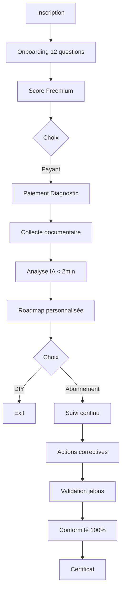

# 📋 ClearGo — Cadrage Technique Complet

## Questions & Réponses Développeur

> **Date :** 16 janvier 2026 | **Version :** 3.0 — Validée | **Destinataire :** Équipe de développement

---

## 📊 Vue d'ensemble du projet

### Résumé exécutif

ClearGo est une plateforme SaaS B2B destinée aux transporteurs routiers (TPE/PME) pour transformer la conformité réglementaire en avantage concurrentiel.

| Aspect       | Détails                                            |
| ------------ | -------------------------------------------------- |
| **Cible**    | Transporteurs routiers 1-50 véhicules              |
| **Problème** | Peur des contrôles, complexité RH, coût consulting |
| **Solution** | Diagnostic IA + Accompagnement + Automatisation    |
| **Modèle**   | Freemium → Diagnostic payant → Abonnement          |

---

## 🔹 A. Vision & Objectifs Business

### Problèmes résolus

| #   | Problème                                                      | Impact                                  |
| --- | ------------------------------------------------------------- | --------------------------------------- |
| 1   | 🚨 **Peur des contrôles** (Inspection du Travail, URSSAF, AT) | Stress permanent, risque sanctions      |
| 2   | 📋 **Complexité administrative RH**                           | Suivi chauffeurs, déclarations sociales |
| 3   | 💰 **Coût prohibitif consulting**                             | 400€/jour TJM, pas accessible TPE/PME   |

### Objectifs mesurables

| Métrique                     | Objectif | Horizon     |
| ---------------------------- | -------- | ----------- |
| Transporteurs accompagnés    | 500      | 12 mois     |
| Taux réussite conformité     | 100%     | Continue    |
| Temps mise en conformité     | < 3 mois | Post-abo    |
| Réduction coût vs consulting | 75%      | —           |
| Conversion freemium → payant | 15-20%   | KPI         |
| Rétention abonnement         | > 85%    | 12 mois     |
| NPS                          | > 50     | Trimestriel |

### Mix IA / Humain

- **80% self-service SaaS** : Diagnostic IA, alertes automatiques, création documents
- **20% humain** : Support, validation complexe, cas limites

---

## 🔹 B. Profils Utilisateurs

### Matrice des rôles

| Profil                       | Rôle métier             | Droits           | Actions                              | Données accessibles       |
| ---------------------------- | ----------------------- | ---------------- | ------------------------------------ | ------------------------- |
| **Transporteur (Dirigeant)** | Payeur principal        | Full admin       | Gestion users, paiements, validation | Toutes                    |
| **Manager / Exploitation**   | Opérationnel            | Accès partiel    | Upload docs, suivi actions           | Vue globale (pas finance) |
| **Responsable Qualité**      | Gestionnaire conformité | Accès étendu     | Actions correctives, e-learning      | Conformité, audits        |
| **Consultant externe**       | Prestataire B2B2C       | Interface dédiée | Gestion multi-clients                | Vue consolidée            |
| **Chauffeur**                | Personnel terrain       | Limité (V2)      | Consultation formations              | Ses données uniquement    |

### Gestion multi-utilisateurs

- **TPE (1-5 chauffeurs)** : 1 utilisateur (dirigeant)
- **PME (5-20 chauffeurs)** : 2-3 utilisateurs
- **ETI (20-50 chauffeurs)** : 3-5 utilisateurs

---

## 🔹 C. Modèle Économique

### Parcours de monétisation

```
FREEMIUM (Gratuit)          DIAGNOSTIC (One-shot)       ABONNEMENT (Mensuel)
     │                            │                           │
     ▼                            ▼                           ▼
12 questions RSE            Analyse approfondie          Suivi continu
Score global                Plan d'action                Alertes auto
Alertes basiques            Priorisation risques         Documents IA
                                                         E-learning
     │                            │                           │
     └──── 50-100€ ───────────────┴────── 150-200€/mois ──────┘
```

### Matrice des services

| Service                       | Freemium | Diagnostic | Abonnement | Modules |
| ----------------------------- | :------: | :--------: | :--------: | :-----: |
| 12 questions RSE              |    ✅    |     ✅     |     ✅     |   ✅    |
| Score conformité global       |    ✅    |     ✅     |     ✅     |   ✅    |
| Analyse détaillée par domaine |    ❌    |     ✅     |     ✅     |   ✅    |
| Plan d'action personnalisé    |    ❌    |     ✅     |     ✅     |   ✅    |
| Suivi mensuel actions         |    ❌    |     ❌     |     ✅     |   ✅    |
| Alertes automatiques          | Limitées |  Limitées  |     ✅     |   ✅    |
| Création documents IA         |    ❌    |     ❌     |     ✅     |   ✅    |
| E-learning                    |    ❌    |     ❌     |     ✅     |   ✅    |
| Support prioritaire           |    ❌    |     ❌     |     ✅     |   ✅    |

### Paiements

- **PSP** : Stripe
- **Méthodes** : CB, prélèvement automatique
- **Facturation** : Auto-génération (conformité 2026)

---

## 🔹 D. Parcours Transporteur

### Cycle de vie complet



### Documents attendus

| Document               | Obligatoire | Format    | Critères              |
| ---------------------- | :---------: | --------- | --------------------- |
| Autorisation d'exercer |     ✅      | PDF, scan | Lisible, date visible |
| Nombre chauffeurs      |     ✅      | Saisie    | Entier > 0            |
| Nombre véhicules       |     ✅      | Saisie    | Entier > 0            |
| Cartes conducteurs     |    Si PL    | PDF, scan | Validité > 30j        |
| Permis de conduire     |  Optionnel  | PDF, scan | Validité OK           |
| DUER                   |  Optionnel  | PDF       | À jour                |

### Actions bloquantes

| Étape non validée               | Actions bloquées                      |
| ------------------------------- | ------------------------------------- |
| Pas de paiement diagnostic      | Accès plan d'action détaillé          |
| Documents minimaux manquants    | Génération roadmap complète           |
| Abonnement inactif              | Suivi actions, alertes, création docs |
| Actions critiques non terminées | Validation jalon final                |

> **Philosophie produit :** Accompagner progressivement, pas bloquer brutalement.

---

## 🔹 E. Base de Connaissances

### Sources réglementaires

**Priorité 1 — Conformité RSE (MVP)**

- Code du Travail (Inspection)
- Code Sécurité Sociale (URSSAF, AT)
- Règlement CE n°561/2006 (Temps conduite)
- Paquet Mobilité européen (Tachygraphe Gen2)
- Loi facturation électronique 2026

**Priorité 2 — Modules optionnels**

- GDP : Directive 2013/C 343/01
- HACCP : Règlement CE 852/2004
- ADR : Accord européen transport

### Structure base

```
Domaines RSE
├── Inspection du Travail
│   ├── Textes applicables
│   ├── Critères d'évaluation
│   ├── FAQ cas pratiques
│   └── Synthèses vulgarisées
├── URSSAF
├── Accidents du Travail
├── Tachygraphe & Temps conduite
└── Facturation électronique 2026
```

### Mise à jour

| Fréquence  | Type                        | Délai       |
| ---------- | --------------------------- | ----------- |
| Critique   | Nouvelle obligation majeure | < 48h       |
| Importante | Changement réglementaire    | < 1 semaine |
| Standard   | Enrichissement              | Mensuelle   |

---

## 🔹 F. Analyse IA & Scoring

### Types d'analyse

| Type                          | Description                   | Priorité |
| ----------------------------- | ----------------------------- | :------: |
| Extraction informations clés  | OCR + NER                     |  ✅ MVP  |
| Vérification conformité       | Comparaison vs référentiel    |  ✅ MVP  |
| Détection documents manquants | Cross-check liste obligatoire |  ✅ MVP  |
| Analyse cohérence             | Nb chauffeurs vs permis       |  ⚠️ V2   |

### Stack technique IA

```
Upload PDF
    ↓
[OCR si scan] → Tesseract / Google Cloud Vision
    ↓
[NER] → spaCy / HuggingFace
    ↓
[Comparaison référentiel] → Vérification conformité
    ↓
[Scoring] → Attribution note
    ↓
[Génération insights] → Recommandations
```

**Temps traitement cible :** < 2 min par document

### Critères d'évaluation RSE

| Domaine                      | Pondération | Documents             |
| ---------------------------- | :---------: | --------------------- |
| Inspection du Travail        |     25%     | Registres, plannings  |
| URSSAF                       |     25%     | Attestations          |
| Accidents du Travail         |     20%     | DUER, fiches AT       |
| Tachygraphe & Temps conduite |     15%     | Cartes, relevés       |
| Facturation électronique     |     10%     | Contrat PSP           |
| Normes environnementales     |     5%      | Certificats véhicules |

### Calcul score global

```python
score_global = (
    0.25 * score_inspection +
    0.25 * score_urssaf +
    0.20 * score_accidents +
    0.15 * score_tachygraphe +
    0.10 * score_facturation +
    0.05 * score_environnement
)
```

### Seuils de décision

| Seuil  | Signification             | Actions                            |
| :----: | ------------------------- | ---------------------------------- |
|  < 40  | 🔴 Risque critique        | Alerte rouge, priorisation urgente |
| 41-70  | 🟠 Partiellement conforme | Roadmap 3 mois minimum             |
| 71-100 | 🟢 Conforme               | Badge vert, dossier conformité     |

### Classification des écarts

- **Critique** : Manquement légal majeur → Action immédiate
- **Majeur** : Non-conformité importante → Action < 30j
- **Mineur** : Amélioration recommandée → Action < 90j

---

## 🔹 G. Génération Roadmap

### Méthode

**Hybride : Templates standardisés + Personnalisation IA**

1. Base de données 200+ actions précodées
2. Personnalisation selon contexte (taille flotte, type activité)
3. Priorisation automatique (Risque × Urgence × Impact)

### Éléments de la roadmap

| Élément               | Description          | Exemple                    |
| --------------------- | -------------------- | -------------------------- |
| Actions correctives   | Liste priorisée      | "Créer DUER"               |
| Délais recommandés    | Échéance réaliste    | "Sous 15j"                 |
| Ressources / Modèles  | Templates, guides    | Template DUER              |
| Responsables suggérés | Qui fait l'action    | Dirigeant                  |
| Dépendances           | Actions bloquantes   | Réserver FIMO avant former |
| Coût estimé           | Budget si applicable | "~500€/chauffeur"          |

### Format

- Vue **Kanban** (À faire / En cours / Terminé)
- Vue **Gantt** (timeline si > 10 actions)
- Vue **Liste** (export PDF)

### RACI Actions

| Action            | Responsible | Accountable | Consulted |  Informed  |
| ----------------- | :---------: | :---------: | :-------: | :--------: |
| Créer DUER        |   Manager   |  Dirigeant  |    RQ     | Chauffeurs |
| Former FIMO       |  Organisme  |  Dirigeant  |  Manager  | Chauffeurs |
| Renouveler cartes |  Dirigeant  |  Dirigeant  |  Manager  |     —      |

---

## 🔹 H. Support & Accompagnement

### Rôles équipe support

| Rôle                        | Description                 | Volume |
| --------------------------- | --------------------------- | :----: |
| Réponse questions complexes | Cas ambigus, interprétation |  60%   |
| Validation analyses IA      | Documents illisibles        |  20%   |
| Onboarding clients          | Formation outil             |  15%   |
| Formation                   | Webinaires, e-learning      |   5%   |

### Mix IA / Humain

| Tâche                 |    Qui     | Quand                 |
| --------------------- | :--------: | --------------------- |
| Diagnostic conformité |   🤖 IA    | Toujours              |
| Génération roadmap    |   🤖 IA    | Toujours              |
| Alertes automatiques  |   🤖 IA    | Toujours              |
| Création documents    |   🤖 IA    | Toujours              |
| FAQ simples           | 🤖 Chatbot | Toujours              |
| Cas ambigus           | 👤 Humain  | Si IA < 80% confiance |
| Validation critique   | 👤 Humain  | Score < 40            |

### Canaux de communication

| Canal        | Disponible | SLA     |
| ------------ | :--------: | ------- |
| Chat intégré |   ✅ MVP   | < 2h    |
| Email        |   ✅ MVP   | < 24h   |
| Téléphone    |  Premium   | Sur RDV |

### SLA par priorité

| Priorité | Définition            | Réponse | Résolution |
| :------: | --------------------- | :-----: | :--------: |
|    P0    | Plateforme HS         |  < 1h   |    < 4h    |
|    P1    | Fonctionnalité cassée |  < 2h   |   < 24h    |
|    P2    | Question complexe     |  < 24h  |    < 3j    |
|    P3    | Amélioration          |  < 48h  |    < 7j    |

---

## 🔹 I. Conformité & Sécurité

### Réglementations couvertes (MVP)

- ✅ Code du Travail
- ✅ Code Sécurité Sociale
- ✅ Règlement CE n°561/2006
- ✅ Paquet Mobilité européen
- ✅ Loi facturation électronique 2026
- ✅ Normes Euro 6

### Traçabilité

| Obligation           | Statut |
| -------------------- | :----: |
| Traçabilité échanges | ✅ OUI |
| Journal d'audit      | ✅ OUI |
| Historique immuable  | ✅ OUI |
| Conformité RGPD      | ✅ OUI |

### Conservation des données

| Type                   |  Durée  | Base légale              |
| ---------------------- | :-----: | ------------------------ |
| Dossiers transporteurs | 10 ans  | Prescription commerciale |
| Documents transmis     | 10 ans  | Obligation transport     |
| Historique support     |  3 ans  | RGPD                     |
| Logs audit             |  5 ans  | Traçabilité              |
| Données paiement       | 13 mois | PCI-DSS                  |

### Responsabilité

**ClearGo :**

- Exactitude base connaissances
- Bon fonctionnement outil
- Veille réglementaire

**Transporteur :**

- Décisions finales
- Véracité documents
- Conformité effective

---

## 🔹 J. Dashboard & Notifications

### Dashboard transporteur

| Widget                    | Contenu             |    MAJ     |
| ------------------------- | ------------------- | :--------: |
| 🎯 Score conformité       | Note 0-100 + jauge  | Temps réel |
| 📊 Progression roadmap    | % actions terminées | Temps réel |
| 🚨 Alertes prioritaires   | Max 3 critiques     | Temps réel |
| 📅 Prochaines actions     | 5 échéances         | Temps réel |
| 📄 Documents à renouveler | Expiration < 30j    | Quotidien  |
| 📈 Historique             | Graphique 6 mois    |  Mensuel   |

### Notifications automatiques

| Type                  | Événement     | Canal          |
| --------------------- | ------------- | -------------- |
| ⏰ Rappels actions    | J-7, J-3, J-1 | Email + In-app |
| 🚨 Alertes critiques  | Score < 40    | Email + SMS    |
| 📢 MAJ réglementaires | Nouveau texte | Email          |
| 🎉 Félicitations      | Jalon terminé | In-app         |
| 📄 Expiration docs    | < 30j         | Email          |

---

## 🔹 K. Technique & Contraintes

### Contraintes connues

| Contrainte           | Détails                       |
| -------------------- | ----------------------------- |
| Web uniquement (MVP) | Pas d'app mobile native       |
| Mobile requis (V2)   | PWA recommandée               |
| Navigateurs          | Chrome, Firefox, Safari, Edge |

### Stack recommandée

**Front-end :** React / Next.js + Tailwind CSS
**Back-end :** Node.js ou Python (FastAPI)
**BDD :** PostgreSQL + Redis
**IA :** HuggingFace, Tesseract, OpenAI API
**Cloud :** AWS / GCP / Azure

### Sécurité

| Exigence                      | Statut |
| ----------------------------- | :----: |
| Hébergement UE                | ✅ OUI |
| HTTPS (TLS 1.3)               | ✅ OUI |
| Chiffrement at rest (AES-256) | ✅ OUI |
| 2FA optionnelle               | ✅ OUI |
| PCI-DSS (via Stripe)          | ✅ OUI |

### Volumétrie cible

| Métrique          |  MVP  | Année 1 |
| ----------------- | :---: | :-----: |
| Transporteurs     |  50   |   500   |
| Utilisateurs      |  75   |   750   |
| Requêtes API/jour | 1 000 | 50 000  |
| Documents/mois    |  500  | 25 000  |

### Performance

| Métrique              |  Cible  | Critique |
| --------------------- | :-----: | :------: |
| Temps chargement page |  < 2s   |   > 5s   |
| Temps analyse IA      | < 2 min | > 5 min  |
| Uptime                | > 99.5% |  < 99%   |

---

## 🔹 L. Intégrations

### MVP

| Système            |   Priorité   | Complexité |
| ------------------ | :----------: | :--------: |
| Stripe (paiements) | ✅ Critique  |   Faible   |
| SendGrid (email)   | ✅ Critique  |   Faible   |
| Twilio (SMS)       | ⚠️ Important |   Faible   |

### V2 (optionnel)

| Système               | Priorité  |
| --------------------- | :-------: |
| TMS transporteurs     | ⚠️ Moyen  |
| API Empreinte Carbone | ⚠️ Faible |
| Plateformes formation | ⚠️ Faible |

---

## 🔹 M. Périmètre MVP

### ✅ Inclus (obligatoire)

| Fonctionnalité                      | Priorité |
| ----------------------------------- | :------: |
| Freemium (12 questions)             |    P0    |
| Diagnostic complet payant           |    P0    |
| Scoring conformité RSE (6 domaines) |    P0    |
| Plan d'action personnalisé          |    P0    |
| Abonnement + suivi mensuel          |    P1    |
| Alertes automatiques                |    P1    |
| Création documents IA               |    P1    |
| Gestion documentaire + OCR          |    P1    |
| E-learning (5-10 modules)           |    P2    |
| Support chat/email                  |    P2    |
| Dashboard transporteur              |    P2    |
| Paiements Stripe                    |    P2    |

### ❌ Hors scope MVP

| Fonctionnalité             | Raison             | Alternative             |
| -------------------------- | ------------------ | ----------------------- |
| Audit blanc physique       | Présence terrain   | Partenariat consultants |
| Accompagnement terrain     | Ressources         | Partenariat             |
| App mobile native          | Complexité         | PWA responsive          |
| Intégration TMS/ERP        | Trop complexe      | Import CSV              |
| Interface consultant B2B2C | À valider          | V2                      |
| Gestion multi-sites        | Modèle à clarifier | V2                      |

---

## 🔹 N. Roadmap Post-MVP

### V1.1 (3 mois post-MVP)

- 🔧 Corrections bugs
- 📊 Amélioration dashboard
- 📱 Optimisation mobile (PWA)
- 🤖 Amélioration IA

### V2 (6-12 mois post-MVP)

- 📦 Modules optionnels (GDP, HACCP, ADR, CO2)
- 👥 Interface consultant externe
- 🏢 Gestion multi-sites
- 📱 App mobile chauffeurs
- 🔗 Intégrations API

### V3 (12-24 mois)

- 🌍 Extension internationale
- 🎓 Marketplace formations
- 🤝 Réseau consultants certifiés
- 📈 Analytics avancées

---

## ⚠️ Clause importante

> **Toute fonctionnalité, règle métier ou contrainte non explicitement mentionnée dans ce document fera l'objet d'un devis complémentaire.**

---

_Document validé — ClearGo Cadrage Technique v3.0_
